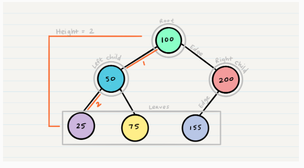

# Tree (data structure)

In computer science, a tree is a widely used abstract data type (ADT) that simulates a hierarchical tree structure, with a root value and subtrees of children with a parent node, represented as a set of linked nodes.

A tree data structure can be defined recursively as a collection of nodes (starting at a root node), where each node is a data structure consisting of a value, together with a list of references to nodes (the "children"), with the constraints that no reference is duplicated, and none points to the root.

Alternatively, a tree can be defined abstractly as a whole (globally) as an ordered tree, with a value assigned to each node. Both these perspectives are useful: while a tree can be analyzed mathematically as a whole, when actually represented as a data structure it is usually represented and worked with separately by node (rather than as a set of nodes and an adjacency list of edges between nodes, as one may represent a digraph, for instance). For example, looking at a tree as a whole, one can talk about "the parent node" of a given node, but in general as a data structure a given node only contains the list of its children, but does not contain a reference to its parent (if any).

## Preliminary definition

A tree is a nonlinear data structure, compared to arrays, linked lists, stacks and queues which are linear data structures. A tree can be empty with no nodes or a tree is a structure consisting of one node called the root and zero or one or more subtrees.

s

[Home Page](https://osamamousa204.github.io/reading-notes-401/)
